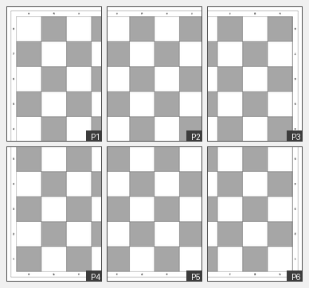

# printable-chessboard
A simple standard tournament size printable chessboard 

# FIDE Tournament Chessboard — Printable A4 Mosaic

## Summary

This project produces a regulation FIDE tournament chessboard at full physical size, printed across six standard A4 pages that assemble into a single mat by overlapping them in a 3×2 grid.

A full FIDE chessboard is 46.4 × 46.4 cm — far larger than a single A4 sheet (21 × 29.7 cm). The solution is a mosaic approach: each page carries a large, overlapping slice of the board, with enough shared area between neighbours that the pages can be aligned precisely by matching the printed squares, then taped or glued together on the back.

The result is a usable paper or light-card chessboard suitable for club practice, school use, travel, or as a template for cutting a mat or vinyl print. It complies with FIDE algebraic notation requirements and correct board orientation.



**Why LaTeX and PDF?** The board is drawn entirely in vector graphics using TikZ. Every line, square, and label is geometrically exact — no raster scaling, no blurry edges at any print resolution. The PDF can be sent directly to any printer or print shop. The LaTeX source is a single self-contained file with no external dependencies beyond a standard TeX distribution, making it easy to modify square size, colours, margin, or font.

**How to use it:**

1. Print all six pages at **100% scale** (disable "fit to page" or "scale to paper" in your print dialog — this is critical).
2. Lay the pages out face-up in the arrangement below:

```
P1  P2  P3
P4  P5  P6
```

3. Align P1 and P2 by matching the shared squares in the overlap zone (files c–d, ranks 8–4). Tape or glue from behind.
4. Add P3 to the right of P2 the same way (shared zone: files e–f, ranks 8–4).
5. Repeat for the bottom row (P4, P5, P6), then attach the bottom row to the top row (shared zone spans ranks 4–5 across all three columns).
6. Trim any excess white margin around the outside if desired.

For a more durable result, print on 160–200 gsm card stock, or use the PDF as a cutting template for a vinyl or neoprene mat.

---

## Board Specification (FIDE Compliance)

The board follows FIDE Laws of Chess and FIDE Equipment Standards.

| Property | Value |
|---|---|
| Square size | 5.5 cm × 5.5 cm |
| Playing area | 44.0 cm × 44.0 cm (8 × 8 squares) |
| Label border width | 1.2 cm on each of the four sides |
| Total board (outer frame) | 46.4 cm × 46.4 cm |
| a1 square | Bottom-left — dark (verified: file index 0 + rank-row index 7 = odd) |
| White's side | Bottom of board (ranks 1–2) |
| Black's side | Top of board (ranks 7–8) |

---

## Page Layout and Mosaic Geometry

Each page is a standard A4 sheet (21.0 × 29.7 cm). The board is tiled across a 3-column × 2-row grid of pages.

### Margins

The outer edge of the board's outer frame sits exactly **1.0 cm** from the page edge on every outer side of the mosaic. Inner sides (where two pages meet) have no explicit margin — the board extends to the page boundary and is clipped.

| Page | Outer edges with 1 cm margin |
|---|---|
| P1 | Left + Top |
| P2 | Top |
| P3 | Right + Top |
| P4 | Left + Bottom |
| P5 | Bottom |
| P6 | Right + Bottom |

### Tile Dimensions and Overlap

| Parameter | Value |
|---|---|
| Tile width per page | 20.0 cm |
| Tile height per page | 28.7 cm |
| Horizontal overlap (between column neighbours) | 6.3 cm |
| Vertical overlap (between row neighbours) | 10.0 cm |

Overlap is deliberately generous: 6.3 cm horizontally and 10.0 cm vertically. This gives a wide zone of shared printed squares to align pages accurately when assembling.

### Board Content per Page

| Page | Files visible | Ranks visible |
|---|---|---|
| P1 | a – d (fully) | 8 – 4 |
| P2 | c – f (fully) | 8 – 4 |
| P3 | e – h (fully) | 8 – 4 |
| P4 | a – d (fully) | 5 – 1 |
| P5 | c – f (fully) | 5 – 1 |
| P6 | e – h (fully) | 5 – 1 |

### Mosaic Offsets (board coordinates)

The board coordinate origin is the top-left corner of the outer frame. Each page renders the slice of the board starting at its offset.

| Page | Horizontal offset | Vertical offset |
|---|---|---|
| P1 | 0.0 cm | 0.0 cm |
| P2 | 13.7 cm | 0.0 cm |
| P3 | 27.4 cm | 0.0 cm |
| P4 | 0.0 cm | 18.7 cm |
| P5 | 13.7 cm | 18.7 cm |
| P6 | 27.4 cm | 18.7 cm |

---

## Colours and Visual Design

The design is printer-friendly: only greyscale ink is used, and light squares are pure white (no ink at all).

| Element | Colour | Notes |
|---|---|---|
| Light squares | Pure white | Zero ink — paper shows through |
| Dark squares | 35% black (black!35) | Ink-saving mid-grey, clearly distinct from white |
| All lines and labels | Pure black (100%) | Maximum contrast |
| Page background | Pure white | No background ink outside the board |

This palette minimises ink consumption while maintaining clear contrast between light and dark squares at any print quality setting, including draft mode.

---

## Lines and Borders

Three distinct line weights are used to create visual hierarchy.

| Element | Line weight | Purpose |
|---|---|---|
| Internal grid lines | 0.3 pt | Separate individual squares; light to avoid visual noise |
| Playing area border | 1.2 pt | Heavy frame enclosing the 8×8 playing grid |
| Outer frame | 0.8 pt | Encloses the entire board including the label strip |

---

## Coordinate Labels

Labels follow FIDE algebraic notation. The coordinate system is absolute and fixed — every square has one name regardless of which player is viewing it.

| Property | Value |
|---|---|
| Font | Helvetica (sans-serif) |
| Weight | Bold |
| Size | 16 pt |
| Colour | Black |
| Files | a – h (columns, left to right from White's side) |
| Ranks | 1 – 8 (rows, bottom to top from White's side) |

Labels appear on all four sides of the board so that both players can read them without turning their head. The labels on the top border and right border carry identical values to the bottom and left borders respectively, but are **rotated 180°** in the artwork. This means each player sees the letters and numbers the correct way up from where they sit, while the coordinate values themselves remain the same — a1 is always a1 for both White and Black.

| Border | Labels | Orientation |
|---|---|---|
| Bottom | a b c d e f g h | Normal (White reads left to right) |
| Top | a b c d e f g h | Rotated 180° (Black reads left to right from their side) |
| Left | 8 7 6 5 4 3 2 1 (top to bottom) | Normal (White reads 1 nearest) |
| Right | 8 7 6 5 4 3 2 1 (top to bottom) | Rotated 180° (Black reads 1 nearest from their side) |

Labels are centred at 0.6 cm from the playing area edge (the midpoint of the 1.2 cm border strip).

---

## Files and Dependencies

| File | Description |
|---|---|
| `chessboard_bw.tex` | LaTeX source — single file, no external images or fonts beyond standard TeX |
| `chessboard_bw.pdf` | Compiled output — 6 pages, ready to print |

**Required LaTeX packages:** `geometry`, `tikz`, `helvet`, `xcolor` (all included in any standard TeX Live or MiKTeX installation).

**To recompile:** run `pdflatex chessboard_bw.tex` twice (two passes ensure stable layout).

---

## Customisation Notes

All key parameters are defined as macros at the top of the LaTeX source and can be changed without touching the drawing logic.

| Macro | Current value | Controls |
|---|---|---|
| `\sq` | 5.5 | Square size in cm |
| `\bd` | 1.2 | Border/label strip width in cm |
| `\btotal` | 46.4 | Total board size in cm (= 2×bd + 8×sq) |

To change the dark square shade, edit `black!35` (the percentage controls ink density — lower is lighter and saves more ink).

To change label size, edit `\fontsize{16}{18}` (first number is point size, second is leading).

Page margins and tile offsets are hardcoded in the `\drawpage` calls and the margin constant `1.0` inside the macro. If the margin is changed, the six offset values in the `\begin{document}` section must be recalculated to maintain the 1 cm outer margin on all sides. The calculation is:

```
col_offsets[2] = 2 × margin + board − a4_width   = 27.4 cm  (for margin=1cm)
col_step       = col_offsets[2] / 2               = 13.7 cm
row_offsets[1] = 2 × margin + board − a4_height  = 18.7 cm
```

Files _50mm contain the chessboard usign a reduced size of 50mm instead of 55mm. This size is also common, especially in environments where space is more limited or slightly smaller pieces are used.
